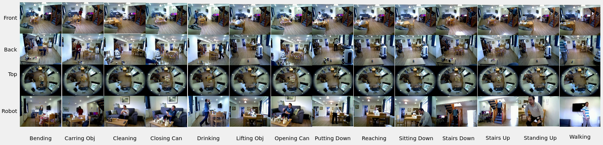

# RHM Dataset Frame Extraction for Human Activity Recognition

## Description
This Python script processes videos from the **RHM (Robot House Multiview)** dataset. It extracts specific frames and applies manual feature extraction, saving them in designated folders. This aids in training deep learning models for human activity recognition.

## Features
- Frame extraction from **RHM** dataset videos.
- Various feature extractions like:
  - Motion Aggregation
  - Frame Variation Mapping
  - Differential Motion Trajectory
  - Normal Frame Extraction
  - Subtract Frame Method
  - Optical Flow
  - Motion History Images
- Configurable frame extraction count and debug options.
- Automated folder creation for frame storage.

## Customizing Feature Extraction
To enable or disable specific feature extractions, set the corresponding flags in the script to `True` or `False`. For example:
- Set `MotionAggregation = True` to enable Motion Aggregation feature extraction.
- Set `OpticalFlow = False` to disable Optical Flow feature extraction.
Adjust these settings based on the required features for your application.


## Getting Started

### Dependencies
- Python 3.x
- OpenCV (`cv2` library)
- NumPy
- Pandas

### Installing
- Ensure Python 3.x is installed.
- Install required Python packages:

  ```bash
  pip install opencv-python numpy pandas
    ```


### Usage
- Clone or download the script.
- Set `RHMPath` in the script to your RHM dataset's location.
- Run the script:

    ```bash
    python main.py
    ```

## RHM Help
For assistance with obtaining the **RHM** dataset, send an email to Patrick at [p.holthaus@herts.ac.uk](mailto:p.holthaus@herts.ac.uk). More information about the Robot House, where the dataset was collected, can be found at [Robot House Website](https://robothouse.herts.ac.uk/).

## RHM Citation
If you are using the **RHM** dataset or this code in your research, please cite the following paper:

Bamorovat Abadi, M., Shahabian Alashti, M. R., Holthaus, P., Menon, C., & Amirabdollahian, F. (2023). RHM: Robot House Multi-View Human Activity Recognition Dataset. In ACHI 2023: The Sixteenth International Conference on Advances in Computer-Human Interactions. IARIA.

[Paper Link](https://www.thinkmind.org/index.php?view=article&articleid=achi_2023_4_160_20077)

Bibtex:
```
@inproceedings{bamorovat2023rhm,
title={Rhm: Robot house multi-view human activity recognition dataset},
author={Bamorovat Abadi, Mohammad and Shahabian Alashti, Mohamad Reza and Holthaus, Patrick and Menon, Catherine and Amirabdollahian, Farshid},
booktitle={ACHI 2023: The Sixteenth International Conference on Advances in Computer-Human Interactions},
year={2023},
organization={IARIA}
}
```

## RHM Dataset picture


## RHM Data Structure

```
RHM
├─ FrontView
│  ├─ train
│  │  └─ 14 classes (folders)
│  ├─ test
│  │  └─ 14 ...
│  └─ val
│     └─ 14 ...
├─ BackView
│  ├─ ...
├─ OmniView
│  ├─ ...
└─ RobotView
   ├─ ...
```

## Code Author
- Mohammad Hossein Bamorovat Abadi
- Contact: m.bamorovvat@gmail.com

## Version History
- 1.0.0

